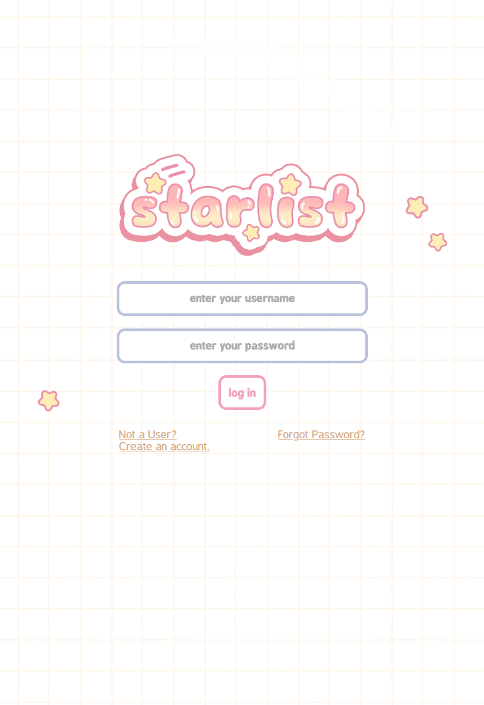
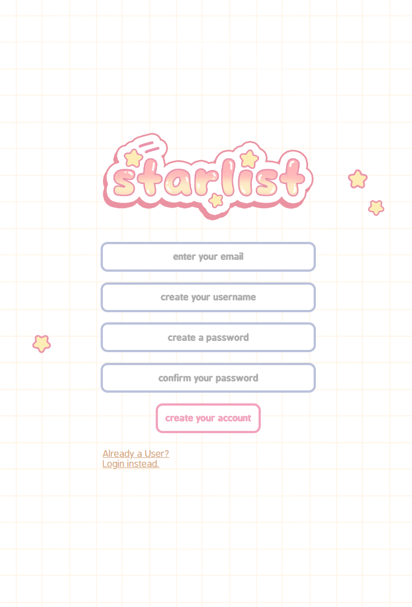
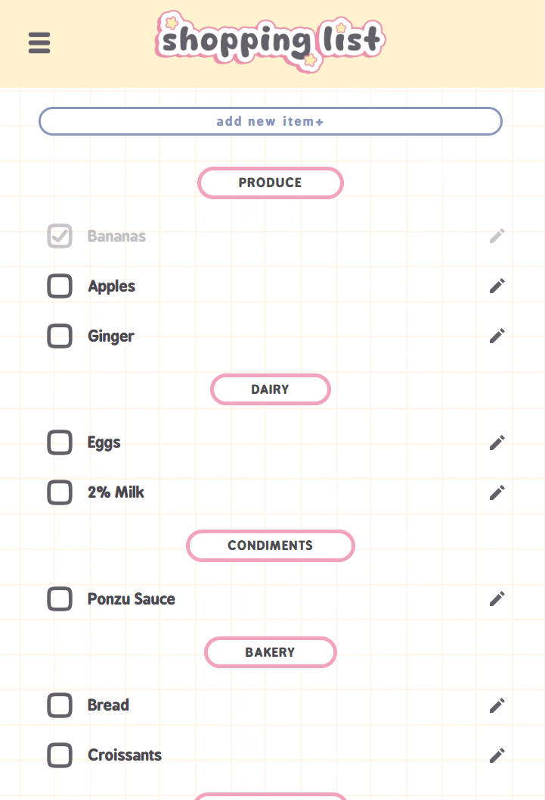
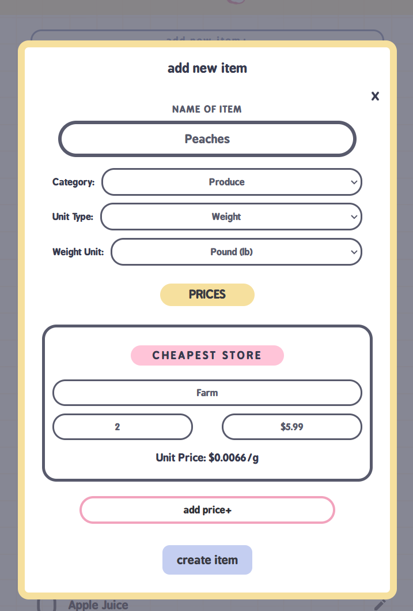
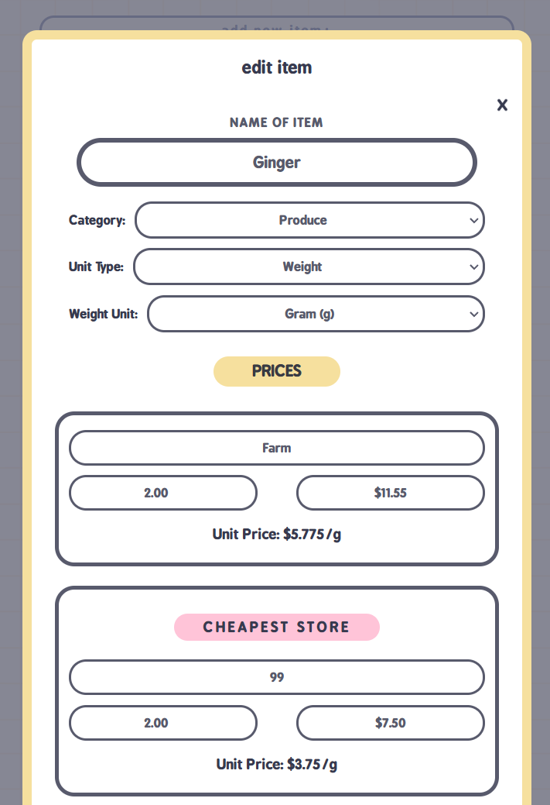

# stardust 

stardust is a social media app. Currently in progress.

 

### ☆ ───── Technologies ───── ☆

 
☆ HTML  
☆ CSS  
☆ Javascript  
☆ PHP  
☆ mySQL  
 

<!--
### ☆ ───── Features ───── ☆
  
☆ Create, edit, delete posts, captions  
☆ Create, edit profiles 
☆ Create, edit profiles 
☆ Create, edit profiles 
☆ Create, edit profiles 
☆ Password encryption 
  
  
### ☆ ───── Screenshots ───── ☆

  

 

    
    
    
    
    

  
 
### ☆ ───── Future enhancements ───── ☆

  
☆ Multiple Lists    -->